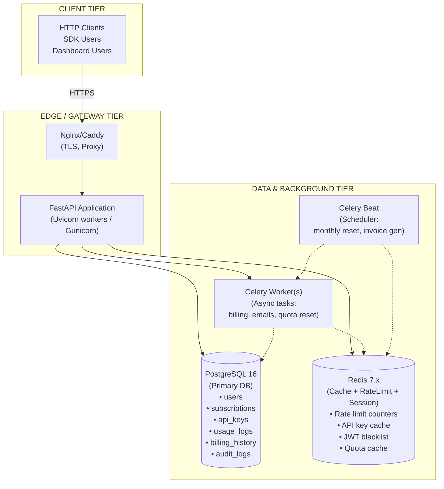

# 🏗️ Commercial SaaS API — Architecture & Design Blueprint

> **Status**: Pre-implementation design review  
> **Stack**: Python / FastAPI · PostgreSQL · Redis · Docker  
> **Scale target**: 200–500 clients (MVP → Growth)  
> **Date**: 2026-10-06

---

## Table of Contents

1. [Overall Architecture](#1-overall-architecture)
2. [Database Design](#2-database-design)
3. [Authentication & Authorization](#3-authentication--authorization)
4. [Subscription Management](#4-subscription-management)
5. [Rate Limiting](#5-rate-limiting)
6. [Usage Tracking & Quota](#6-usage-tracking--quota)
7. [Race Conditions & Concurrency](#7-race-conditions--concurrency)
8. [Security](#8-security)
9. [Operational Concerns](#9-operational-concerns)
10. [Deployment](#10-deployment)
11. [CI/CD](#11-cicd)
12. [Roadmap](#12-roadmap)

---

## 1. Overall Architecture

### 1.1 System Components Overview



### 1.2 Mandatory vs Optional Components

| Component | Phase | Reason |
|---|---|---|
| **FastAPI + Uvicorn** | MVP | Core application server |
| **PostgreSQL** | MVP | All persistent data |
| **Nginx/Caddy** | MVP | TLS termination, reverse proxy |
| **Redis** | MVP | Rate limiting (far simpler than DB-based at scale) |
| **Celery + Beat** | MVP | Async emails, quota resets, billing jobs |
| **Docker Compose** | MVP | Reproducible local + prod environment |
| **Sentry / Logging** | MVP | Observability — do NOT skip this |
| **Prometheus + Grafana** | Phase 2 (200 users) | Metrics dashboards |
| **PgBouncer** | Phase 2 | Connection pooling when connections spike |
| **CDN (Cloudflare)** | Phase 2 | DDoS mitigation + caching |
| **Read replica (PG)** | Phase 3 (500 users) | Offload analytics/reporting queries |
| **Kubernetes** | Phase 3+ | Only if Docker Compose becomes a bottleneck |

> **Trade-off**: Redis is added from MVP even though PostgreSQL could handle rate limiting at small scale. The reason is that Redis atomic INCR + TTL is far simpler, faster, and avoids locking on the `usage_logs` table during high-frequency requests. The cost is one extra service — acceptable.

### 1.3 API Endpoint Skeleton (10 endpoints)

| # | Method | Path | Description |
|---|---|---|---|
| 1 | POST | `/auth/register` | Create account |
| 2 | POST | `/auth/login` | Get JWT |
| 3 | POST | `/auth/logout` | Invalidate JWT |
| 4 | GET | `/me` | Profile + subscription status |
| 5 | GET | `/api-keys` | List active API keys |
| 6 | POST | `/api-keys` | Generate new API key |
| 7 | DELETE | `/api-keys/{key_id}` | Revoke API key |
| 8 | GET | `/subscriptions/plans` | List available plans |
| 9 | POST | `/subscriptions/subscribe` | Subscribe / upgrade plan |
| 10 | GET | `/usage` | Usage stats for current period |

> Business endpoints (your actual product API, e.g. `/v1/analyze`, `/v1/process`) sit behind middleware that checks API key + subscription validity + rate limits.

---

## 2. Database Design

### 2.1 Schema

```sql
-- ============================================================
-- USERS
-- Core identity. Email is the unique login identifier.
-- ============================================================
CREATE TABLE users (
    id            UUID PRIMARY KEY DEFAULT gen_random_uuid(),
    email         TEXT NOT NULL UNIQUE,
    password_hash TEXT NOT NULL,              -- bcrypt
    full_name     TEXT,
    is_active     BOOLEAN NOT NULL DEFAULT TRUE,
    is_verified   BOOLEAN NOT NULL DEFAULT FALSE,
    created_at    TIMESTAMPTZ NOT NULL DEFAULT NOW(),
    updated_at    TIMESTAMPTZ NOT NULL DEFAULT NOW()
);

CREATE INDEX idx_users_email ON users (email);

-- ============================================================
-- SUBSCRIPTION PLANS
-- Static config table. Seeded at deployment.
-- ============================================================
CREATE TABLE subscription_plans (
    id               UUID PRIMARY KEY DEFAULT gen_random_uuid(),
    name             TEXT NOT NULL UNIQUE,       -- 'free', 'starter', 'pro', 'enterprise'
    display_name     TEXT NOT NULL,
    price_monthly    NUMERIC(10,2) NOT NULL DEFAULT 0,
    price_yearly     NUMERIC(10,2) NOT NULL DEFAULT 0,
    requests_per_min  INT NOT NULL DEFAULT 10,
    requests_per_day  INT NOT NULL DEFAULT 1000,
    requests_per_month INT NOT NULL DEFAULT 10000,
    max_api_keys      INT NOT NULL DEFAULT 2,
    features          JSONB NOT NULL DEFAULT '{}', -- extensible feature flags
    is_active         BOOLEAN NOT NULL DEFAULT TRUE,
    created_at        TIMESTAMPTZ NOT NULL DEFAULT NOW()
);

-- ============================================================
-- USER SUBSCRIPTIONS
-- One active subscription per user at any time.
-- ============================================================
CREATE TABLE user_subscriptions (
    id              UUID PRIMARY KEY DEFAULT gen_random_uuid(),
    user_id         UUID NOT NULL REFERENCES users(id) ON DELETE CASCADE,
    plan_id         UUID NOT NULL REFERENCES subscription_plans(id),
    status          TEXT NOT NULL CHECK (status IN ('trialing','active','past_due','canceled','expired')),
    billing_cycle   TEXT NOT NULL CHECK (billing_cycle IN ('monthly','yearly','trial','lifetime')),
    current_period_start  TIMESTAMPTZ NOT NULL,
    current_period_end    TIMESTAMPTZ NOT NULL,
    trial_end             TIMESTAMPTZ,
    canceled_at           TIMESTAMPTZ,
    external_subscription_id TEXT,              -- Stripe subscription ID, if integrated
    created_at      TIMESTAMPTZ NOT NULL DEFAULT NOW(),
    updated_at      TIMESTAMPTZ NOT NULL DEFAULT NOW()
);

CREATE INDEX idx_user_subscriptions_user_id ON user_subscriptions (user_id);
CREATE INDEX idx_user_subscriptions_status  ON user_subscriptions (status);
-- Fast lookup of active subscription for a user:
CREATE INDEX idx_user_subscriptions_active ON user_subscriptions (user_id, status)
    WHERE status = 'active';

-- ============================================================
-- API KEYS
-- Multiple keys per user (up to plan.max_api_keys).
-- The raw key is shown ONCE on creation; only hash stored.
-- ============================================================
CREATE TABLE api_keys (
    id           UUID PRIMARY KEY DEFAULT gen_random_uuid(),
    user_id      UUID NOT NULL REFERENCES users(id) ON DELETE CASCADE,
    key_hash     TEXT NOT NULL UNIQUE,    -- SHA-256 of the actual key
    key_prefix   TEXT NOT NULL,           -- first 8 chars, shown in UI: "sk_live_abcd1234..."
    name         TEXT NOT NULL,           -- user-friendly label
    last_used_at TIMESTAMPTZ,
    is_active    BOOLEAN NOT NULL DEFAULT TRUE,
    expires_at   TIMESTAMPTZ,             -- NULL = no expiry
    created_at   TIMESTAMPTZ NOT NULL DEFAULT NOW(),
    revoked_at   TIMESTAMPTZ
);

CREATE INDEX idx_api_keys_user_id  ON api_keys (user_id);
CREATE INDEX idx_api_keys_key_hash ON api_keys (key_hash);  -- critical hot path

-- ============================================================
-- USAGE LOGS
-- Per-request event log. Used for billing and quota.
-- Partition by month in Phase 3 for performance.
-- ============================================================
CREATE TABLE usage_logs (
    id            BIGSERIAL PRIMARY KEY,
    user_id       UUID NOT NULL REFERENCES users(id),
    api_key_id    UUID REFERENCES api_keys(id),
    endpoint      TEXT NOT NULL,
    method        TEXT NOT NULL,
    status_code   INT,
    response_time_ms INT,
    request_size_bytes INT,
    ip_address    INET,
    period_year   SMALLINT NOT NULL,   -- denormalized for fast monthly aggregation
    period_month  SMALLINT NOT NULL,
    created_at    TIMESTAMPTZ NOT NULL DEFAULT NOW()
);

-- Composite index: most queries filter by user + period
CREATE INDEX idx_usage_logs_user_period
    ON usage_logs (user_id, period_year, period_month);
CREATE INDEX idx_usage_logs_created_at
    ON usage_logs (created_at DESC);

-- ============================================================
-- USAGE COUNTERS
-- Aggregated counters per user per period. 
-- Updated atomically. Avoids COUNT(*) on usage_logs hot path.
-- ============================================================
CREATE TABLE usage_counters (
    id           BIGSERIAL PRIMARY KEY,
    user_id      UUID NOT NULL REFERENCES users(id) ON DELETE CASCADE,
    period_year  SMALLINT NOT NULL,
    period_month SMALLINT NOT NULL,
    total_requests BIGINT NOT NULL DEFAULT 0,
    updated_at   TIMESTAMPTZ NOT NULL DEFAULT NOW(),
    UNIQUE (user_id, period_year, period_month)
);

CREATE INDEX idx_usage_counters_user_period
    ON usage_counters (user_id, period_year, period_month);

-- ============================================================
-- BILLING HISTORY
-- Immutable ledger. Append-only. Never update rows.
-- ============================================================
CREATE TABLE billing_history (
    id              UUID PRIMARY KEY DEFAULT gen_random_uuid(),
    user_id         UUID NOT NULL REFERENCES users(id),
    subscription_id UUID REFERENCES user_subscriptions(id),
    amount          NUMERIC(10,2) NOT NULL,
    currency        TEXT NOT NULL DEFAULT 'USD',
    status          TEXT NOT NULL CHECK (status IN ('pending','paid','failed','refunded')),
    description     TEXT,
    external_payment_id TEXT,   -- Stripe charge ID
    period_start    TIMESTAMPTZ,
    period_end      TIMESTAMPTZ,
    created_at      TIMESTAMPTZ NOT NULL DEFAULT NOW()
);

CREATE INDEX idx_billing_history_user_id ON billing_history (user_id);
CREATE INDEX idx_billing_history_status  ON billing_history (status);

-- ============================================================
-- AUDIT LOGS
-- Security and admin events. Append-only.
-- ============================================================
CREATE TABLE audit_logs (
    id          BIGSERIAL PRIMARY KEY,
    user_id     UUID REFERENCES users(id),
    actor_ip    INET,
    event_type  TEXT NOT NULL,   -- 'login', 'key_created', 'key_revoked', 'plan_changed', etc.
    entity_type TEXT,            -- 'api_key', 'subscription', etc.
    entity_id   TEXT,
    metadata    JSONB DEFAULT '{}',
    created_at  TIMESTAMPTZ NOT NULL DEFAULT NOW()
);

CREATE INDEX idx_audit_logs_user_id    ON audit_logs (user_id);
CREATE INDEX idx_audit_logs_event_type ON audit_logs (event_type);
CREATE INDEX idx_audit_logs_created_at ON audit_logs (created_at DESC);
```

### 2.2 Rationale Summary

| Table | Rationale |
|---|---|
| `users` | Minimal identity. No PII beyond email/name. |
| `subscription_plans` | Seed data — decouples plan config from code. Change limits without deploy. |
| `user_subscriptions` | Tracks full lifecycle. One row per subscription period, not one per user. |
| `api_keys` | Hash-only storage — raw key is unrecoverable server-side. `key_prefix` enables UI display. |
| `usage_logs` | Audit trail & raw source of truth for billing disputes. Partitioned later. |
| `usage_counters` | Denormalized fast counter. Prevents COUNT(*) on large `usage_logs` table during quota checks. |
| `billing_history` | Immutable ledger. Never `UPDATE`. Append `refunded` rows instead. |
| `audit_logs` | Security forensics. Append-only. Separate table to avoid slow JOINs on hot tables. |

---

## 3. Authentication & Authorization

### 3.1 Decision: JWT + API Key (Dual Mode)

```
Dashboard users  →  JWT (short-lived, 15 min access + 7 day refresh)
API consumers    →  API Key in header: X-API-Key: sk_live_<random>
```

**Why not API key only?** Dashboard sessions need expiry and CSRF protection.  
**Why not JWT only?** API consumers need stable, programmable credentials.  
**Why not OAuth2?** Over-engineering at this scale. Add later if B2B SSO is required.

### 3.2 JWT Implementation

```python
# app/core/security.py
import secrets
import hashlib
from datetime import datetime, timedelta, timezone
from typing import Optional

import jwt
from passlib.context import CryptContext
from app.core.config import settings

pwd_context = CryptContext(schemes=["bcrypt"], deprecated="auto")

def hash_password(password: str) -> str:
    return pwd_context.hash(password)

def verify_password(plain: str, hashed: str) -> bool:
    return pwd_context.verify(plain, hashed)

def create_access_token(user_id: str, email: str) -> str:
    expire = datetime.now(timezone.utc) + timedelta(minutes=settings.ACCESS_TOKEN_EXPIRE_MINUTES)
    payload = {
        "sub": user_id,
        "email": email,
        "exp": expire,
        "iat": datetime.now(timezone.utc),
        "type": "access",
    }
    return jwt.encode(payload, settings.SECRET_KEY, algorithm="HS256")

def create_refresh_token(user_id: str) -> str:
    expire = datetime.now(timezone.utc) + timedelta(days=settings.REFRESH_TOKEN_EXPIRE_DAYS)
    payload = {
        "sub": user_id,
        "exp": expire,
        "type": "refresh",
    }
    return jwt.encode(payload, settings.SECRET_KEY, algorithm="HS256")

def decode_token(token: str) -> dict:
    return jwt.decode(token, settings.SECRET_KEY, algorithms=["HS256"])
```

### 3.3 API Key Generation and Storage

```python
# app/core/api_keys.py
import secrets
import hashlib

def generate_api_key() -> tuple[str, str, str]:
    """
    Returns (raw_key, key_hash, key_prefix)
    raw_key  → shown to user ONCE, never stored
    key_hash → SHA-256, stored in DB
    key_prefix → first 12 chars for UI display
    """
    random_bytes = secrets.token_urlsafe(32)
    raw_key = f"sk_live_{random_bytes}"
    key_hash = hashlib.sha256(raw_key.encode()).hexdigest()
    key_prefix = raw_key[:16]
    return raw_key, key_hash, key_prefix

def hash_api_key(raw_key: str) -> str:
    return hashlib.sha256(raw_key.encode()).hexdigest()
```

### 3.4 API Key Authentication Middleware

```python
# app/middleware/auth.py
from fastapi import Request, HTTPException, status
from app.core.api_keys import hash_api_key
from app.db.session import get_db
from app.crud.api_keys import get_active_key_by_hash

async def api_key_auth(request: Request):
    raw_key = request.headers.get("X-API-Key")
    if not raw_key:
        raise HTTPException(status_code=401, detail="API key required")

    key_hash = hash_api_key(raw_key)

    # 1. Check Redis cache first (avoids DB hit on every request)
    cached = await request.app.state.redis.get(f"apikey:{key_hash}")
    if cached == b"invalid":
        raise HTTPException(status_code=401, detail="Invalid or revoked API key")

    if cached:
        # Deserialize cached user_id + plan info
        import json
        return json.loads(cached)

    # 2. DB lookup (cache miss)
    async with get_db() as db:
        key_record = await get_active_key_by_hash(db, key_hash)
        if not key_record or not key_record.is_active:
            # Cache negative result for 60s to prevent repeated DB hits on brute force
            await request.app.state.redis.setex(f"apikey:{key_hash}", 60, b"invalid")
            raise HTTPException(status_code=401, detail="Invalid or revoked API key")

        payload = {
            "user_id": str(key_record.user_id),
            "api_key_id": str(key_record.id),
            "plan": key_record.user.subscription.plan.name,
            "limits": {
                "rpm": key_record.user.subscription.plan.requests_per_min,
                "rpd": key_record.user.subscription.plan.requests_per_day,
                "rpm_month": key_record.user.subscription.plan.requests_per_month,
            }
        }
        # Cache for 5 minutes — revocation takes up to 5 min to propagate
        await request.app.state.redis.setex(
            f"apikey:{key_hash}", 300, json.dumps(payload).encode()
        )
        return payload
```

### 3.5 Key Rotation and Revocation

**Rotation flow:**
1. Client calls `POST /api-keys` → receives new key
2. Client calls `DELETE /api-keys/{old_id}` → marks old key `is_active=FALSE`, sets `revoked_at`
3. Write `audit_logs` entry
4. Delete Redis cache entry for old key hash → immediate invalidation

**Grace period pattern** (optional): Allow old key to work for 10 minutes after rotation using a separate Redis TTL. Helps clients that pre-rotate.

---

## 4. Subscription Management

### 4.1 Plan Seed Data

```python
# app/db/seeds/plans.py
PLANS = [
    {
        "name": "free",
        "display_name": "Free",
        "price_monthly": 0,
        "price_yearly": 0,
        "requests_per_min": 10,
        "requests_per_day": 500,
        "requests_per_month": 5000,
        "max_api_keys": 1,
        "features": {"support": "community"},
    },
    {
        "name": "starter",
        "display_name": "Starter",
        "price_monthly": 19.00,
        "price_yearly": 190.00,
        "requests_per_min": 60,
        "requests_per_day": 5000,
        "requests_per_month": 50000,
        "max_api_keys": 3,
        "features": {"support": "email"},
    },
    {
        "name": "pro",
        "display_name": "Pro",
        "price_monthly": 79.00,
        "price_yearly": 790.00,
        "requests_per_min": 300,
        "requests_per_day": 50000,
        "requests_per_month": 500000,
        "max_api_keys": 10,
        "features": {"support": "priority", "webhooks": True},
    },
]
```

### 4.2 Subscription Validation Middleware

```python
# app/middleware/subscription.py
from fastapi import Request, HTTPException
from datetime import datetime, timezone

async def check_subscription(request: Request, auth_context: dict):
    user_id = auth_context["user_id"]

    # Check Redis cache first
    redis = request.app.state.redis
    cached_status = await redis.get(f"sub_status:{user_id}")

    if cached_status == b"invalid":
        raise HTTPException(
            status_code=402,
            detail={
                "code": "SUBSCRIPTION_REQUIRED",
                "message": "Your subscription has expired. Please renew to continue.",
            }
        )

    if not cached_status:
        # DB check
        async with get_db() as db:
            sub = await get_active_subscription(db, user_id)
            if not sub or sub.current_period_end < datetime.now(timezone.utc):
                await redis.setex(f"sub_status:{user_id}", 300, b"invalid")
                raise HTTPException(status_code=402, detail={"code": "SUBSCRIPTION_REQUIRED"})
            # Cache valid status until period end (max 1 hour)
            ttl = min(3600, int((sub.current_period_end - datetime.now(timezone.utc)).total_seconds()))
            await redis.setex(f"sub_status:{user_id}", max(ttl, 60), b"valid")
```

### 4.3 Expired Subscription Handling

- **Grace period**: Allow 3-day grace period before hard blocking (configurable per plan)
- **Status machine**: `trialing → active → past_due (grace) → expired`
- **Celery task**: Daily job checks for subscriptions expiring within 7 days, sends email reminders
- **Auto-downgrade**: After grace period, move user to `free` plan rather than hard blocking (reduces churn)

```python
# app/tasks/subscription_tasks.py
from celery import shared_task
from app.db.session import SyncSessionLocal

@shared_task
def process_expired_subscriptions():
    """Run daily via Celery Beat. Downgrades past_due to free plan."""
    with SyncSessionLocal() as db:
        grace_cutoff = datetime.now(timezone.utc) - timedelta(days=3)
        expired = db.execute(
            select(UserSubscription)
            .where(UserSubscription.status == "past_due")
            .where(UserSubscription.current_period_end < grace_cutoff)
        ).scalars().all()

        free_plan = db.execute(
            select(SubscriptionPlan).where(SubscriptionPlan.name == "free")
        ).scalar_one()

        for sub in expired:
            sub.status = "expired"
            # Create new free subscription
            new_sub = UserSubscription(
                user_id=sub.user_id,
                plan_id=free_plan.id,
                status="active",
                billing_cycle="monthly",
                current_period_start=datetime.now(timezone.utc),
                current_period_end=datetime.now(timezone.utc) + timedelta(days=30),
            )
            db.add(new_sub)
        db.commit()
```

---

## 5. Rate Limiting

### 5.1 Decision: Redis-based Sliding Window

**At 200–500 users** with potentially high req/min per user, a Redis sliding window is the right choice.

| Approach | Pros | Cons | Verdict |
|---|---|---|---|
| PostgreSQL counter | No extra service | Slow under load, locks | ❌ Not for rate limiting |
| Redis fixed window | Simple, fast | Boundary burst problem | ⚠️ Acceptable for basic |
| Redis sliding window (token bucket) | Accurate, no boundary burst | Slightly more complex | ✅ **Recommended** |
| Third-party (nginx limit_req) | Zero code | Less granular | ⚠️ Use as backup layer |

### 5.2 Multi-Level Rate Limiter

```python
# app/middleware/rate_limit.py
import time
from fastapi import Request, HTTPException
from app.core.config import settings

class RateLimiter:
    """
    Sliding window rate limiter using Redis sorted sets.
    Tracks: per-minute, per-day, per-month.
    """
    def __init__(self, redis):
        self.redis = redis

    async def check(self, user_id: str, limits: dict) -> None:
        now = time.time()
        pipe = self.redis.pipeline()

        windows = {
            "min":   {"ttl": 60,         "limit": limits["rpm"],       "start": now - 60},
            "day":   {"ttl": 86400,      "limit": limits["rpd"],       "start": now - 86400},
            "month": {"ttl": 31*86400,   "limit": limits["rpm_month"], "start": now - 31*86400},
        }

        for window_name, cfg in windows.items():
            key = f"rl:{user_id}:{window_name}"
            pipe.zremrangebyscore(key, 0, cfg["start"])
            pipe.zcard(key)
            pipe.zadd(key, {str(now): now})
            pipe.expire(key, cfg["ttl"])

        results = await pipe.execute()

        # Results come in groups of 4 per window
        for i, (window_name, cfg) in enumerate(windows.items()):
            count = results[i * 4 + 1]  # zcard result
            if count >= cfg["limit"]:
                raise HTTPException(
                    status_code=429,
                    headers={
                        "X-RateLimit-Limit": str(cfg["limit"]),
                        "X-RateLimit-Window": window_name,
                        "Retry-After": str(int(cfg["ttl"])),
                    },
                    detail={
                        "code": "RATE_LIMIT_EXCEEDED",
                        "window": window_name,
                        "limit": cfg["limit"],
                    }
                )
```

### 5.3 Nginx as Backup Rate Limit (DDoS coarse filter)

```nginx
# nginx.conf
limit_req_zone $binary_remote_addr zone=api:10m rate=100r/s;

location /v1/ {
    limit_req zone=api burst=200 nodelay;
    proxy_pass http://app:8000;
}
```

> **Trade-off**: Nginx rate limit is by IP (anonymous), Redis is by user. Use both layers. Nginx protects before requests even hit your app.

---

## 6. Usage Tracking & Quota

### 6.1 Hybrid Tracking Strategy

```
Request arrives
     │
     ▼
[Auth + Rate Limit] → 429 if exceeded
     │
     ▼
[Execute business logic]
     │
     ▼
[Return response to client]
     │
     ▼  (background, non-blocking)
[Log to Redis counter + async write to DB]
```

**Why async logging?** Adding a DB write to every request path adds 5–20ms latency. For read-heavy APIs this is significant. Write to Redis synchronously (1ms), drain to DB asynchronously.

### 6.2 Fast Counter Pattern

```python
# app/middleware/usage_tracker.py
from fastapi import Request, Response
import asyncio

async def track_usage(request: Request, response: Response, auth_context: dict):
    """
    Called after response is sent (via BackgroundTask or middleware post-hook).
    """
    user_id = auth_context["user_id"]
    api_key_id = auth_context.get("api_key_id")
    redis = request.app.state.redis

    from datetime import datetime
    now = datetime.utcnow()
    period_key = f"{now.year}:{now.month}"

    # Atomically increment Redis counter
    pipe = redis.pipeline()
    pipe.incr(f"usage:{user_id}:{period_key}")
    pipe.expire(f"usage:{user_id}:{period_key}", 35 * 86400)  # 35 days TTL
    await pipe.execute()

    # Enqueue DB write as background task (non-blocking)
    from app.tasks.usage_tasks import record_usage_log
    record_usage_log.delay(
        user_id=user_id,
        api_key_id=api_key_id,
        endpoint=request.url.path,
        method=request.method,
        status_code=response.status_code,
        period_year=now.year,
        period_month=now.month,
    )
```

### 6.3 Monthly Quota Check

```python
async def check_monthly_quota(user_id: str, monthly_limit: int, redis) -> None:
    from datetime import datetime
    now = datetime.utcnow()
    period_key = f"usage:{user_id}:{now.year}:{now.month}"

    count = await redis.get(period_key)
    if count is None:
        # Cold start: load from DB
        count = await get_monthly_count_from_db(user_id, now.year, now.month)
        await redis.setex(period_key, 35 * 86400, count)

    if int(count) >= monthly_limit:
        raise HTTPException(
            status_code=429,
            detail={
                "code": "MONTHLY_QUOTA_EXCEEDED",
                "used": int(count),
                "limit": monthly_limit,
            }
        )
```

### 6.4 Celery Monthly Reset Task

```python
# Runs on the 1st of each month at 00:05 UTC
@shared_task
def reset_monthly_counters():
    """
    Flushes Redis monthly counters. DB usage_logs remain for billing history.
    """
    # Redis counters expire naturally due to 35-day TTL.
    # This task only syncs DB usage_counters aggregate.
    pass  # TTL handles Redis; Celery syncs DB
```

---

## 7. Race Conditions & Concurrency

### 7.1 Identified Race Conditions

| Scenario | Risk | Solution |
|---|---|---|
| Two requests simultaneously read quota, both pass, quota exceeded | Quota over-use | Redis INCR (atomic) + check-then-decrement pattern |
| Payment webhook fires twice (Stripe) | Double payment record | Idempotency key on `billing_history.external_payment_id` UNIQUE constraint |
| Subscription renewal + API call simultaneously | Stale plan cache | Short Redis TTL (5 min) + version tag |
| Two API key creation requests at same time reaching max_api_keys | Over-limit keys | DB-level: COUNT with `SELECT FOR UPDATE` |
| Celery task processes same expired subscription twice | Duplicate downgrade | DB unique constraint on active subscription per user |

### 7.2 Quota Deduction with Redis Atomic Check

```python
# Safe atomic quota check + increment using Lua script
QUOTA_SCRIPT = """
local current = redis.call('GET', KEYS[1])
if current == false then
    current = 0
else
    current = tonumber(current)
end
if current >= tonumber(ARGV[1]) then
    return -1  -- over limit
end
redis.call('INCR', KEYS[1])
redis.call('EXPIRE', KEYS[1], ARGV[2])
return current + 1
"""

async def atomic_quota_check_and_increment(
    redis, user_id: str, monthly_limit: int
) -> int:
    from datetime import datetime
    now = datetime.utcnow()
    key = f"usage:{user_id}:{now.year}:{now.month}"
    result = await redis.eval(QUOTA_SCRIPT, 1, key, monthly_limit, 35 * 86400)
    if result == -1:
        raise HTTPException(status_code=429, detail={"code": "MONTHLY_QUOTA_EXCEEDED"})
    return result
```

### 7.3 API Key Count with Row Locking

```python
# app/crud/api_keys.py
from sqlalchemy import select, func
from sqlalchemy.ext.asyncio import AsyncSession

async def create_api_key_safe(db: AsyncSession, user_id: str, plan_max_keys: int, name: str):
    async with db.begin():
        # Lock user row to serialize concurrent key creation
        user = await db.execute(
            select(User).where(User.id == user_id).with_for_update()
        )
        user = user.scalar_one_or_none()

        key_count = await db.execute(
            select(func.count(APIKey.id))
            .where(APIKey.user_id == user_id)
            .where(APIKey.is_active == True)
        )
        count = key_count.scalar()

        if count >= plan_max_keys:
            raise HTTPException(
                status_code=400,
                detail=f"Maximum API keys ({plan_max_keys}) for your plan reached."
            )

        raw_key, key_hash, key_prefix = generate_api_key()
        new_key = APIKey(
            user_id=user_id,
            key_hash=key_hash,
            key_prefix=key_prefix,
            name=name,
        )
        db.add(new_key)
        return raw_key, new_key  # Return raw_key ONCE
```

### 7.4 Idempotent Billing

```python
# app/crud/billing.py
async def record_payment(db, user_id, amount, external_payment_id: str, ...):
    """Stripe can call webhooks multiple times. Use UPSERT to be safe."""
    stmt = insert(BillingHistory).values(
        user_id=user_id,
        amount=amount,
        status="paid",
        external_payment_id=external_payment_id,
        ...
    ).on_conflict_do_nothing(index_elements=["external_payment_id"])
    await db.execute(stmt)
    await db.commit()
```

---

## 8. Security

### 8.1 Threat Model & Mitigations

| Attack | Risk | Mitigation | Complexity |
|---|---|---|---|
| **Brute force login** | Account takeover | Rate limit `/auth/login` per IP (5 req/min), lockout after 10 fails | Low |
| **Credential stuffing** | Mass account takeover | Same as brute force + HaveIBeenPwned check on register | Low–Med |
| **API key brute force** | Unauthorized access | Rate limit unauthenticated requests; negative cache; key prefix doesn't expose the secret portion | Low |
| **API abuse (scraping)** | Quota theft | Per-user rate limits enforced in middleware | Low |
| **SQL injection** | Data breach | SQLAlchemy ORM + parameterized queries — never raw f-string SQL | Near zero |
| **Replay attacks** | Request duplication | Short JWT expiry (15 min) + JWT blacklist in Redis on logout | Medium |
| **API key leakage** | Key compromise | Only hash stored; prefix shown in UI; rotate immediately via API | Low |
| **DDoS (small-medium)** | Availability | Nginx rate limit by IP + Cloudflare free tier in Phase 2 | Low |
| **SSRF / injection in request body** | Internal network access | Validate all user-provided URLs; use allowlist for any URL fetch | Medium |

### 8.2 Security Middleware Stack (FastAPI)

```python
# app/main.py
from fastapi import FastAPI
from fastapi.middleware.trustedhost import TrustedHostMiddleware
from starlette.middleware.cors import CORSMiddleware
from app.middleware.security_headers import SecurityHeadersMiddleware

app = FastAPI()

# CORS: only your frontend domain
app.add_middleware(
    CORSMiddleware,
    allow_origins=["https://yourdomain.com"],
    allow_methods=["GET", "POST", "PUT", "DELETE"],
    allow_headers=["X-API-Key", "Authorization", "Content-Type"],
)

# Prevent Host header injection
app.add_middleware(TrustedHostMiddleware, allowed_hosts=["yourdomain.com", "api.yourdomain.com"])

# Security response headers
app.add_middleware(SecurityHeadersMiddleware)
```

```python
# app/middleware/security_headers.py
from starlette.middleware.base import BaseHTTPMiddleware

class SecurityHeadersMiddleware(BaseHTTPMiddleware):
    async def dispatch(self, request, call_next):
        response = await call_next(request)
        response.headers["X-Content-Type-Options"] = "nosniff"
        response.headers["X-Frame-Options"] = "DENY"
        response.headers["Strict-Transport-Security"] = "max-age=31536000; includeSubDomains"
        response.headers["Content-Security-Policy"] = "default-src 'none'"
        return response
```

### 8.3 Login Brute Force Protection

```python
# app/routers/auth.py
@router.post("/login")
async def login(credentials: LoginRequest, request: Request, redis=Depends(get_redis)):
    ip = request.client.host
    lockout_key = f"lockout:{ip}"
    fail_key = f"login_fails:{ip}"

    if await redis.get(lockout_key):
        raise HTTPException(status_code=429, detail="Too many failed attempts. Try again later.")

    # ... verify credentials ...
    if not authenticated:
        fails = await redis.incr(fail_key)
        await redis.expire(fail_key, 900)  # 15-minute window
        if fails >= 10:
            await redis.setex(lockout_key, 900, 1)  # 15-minute lockout
        raise HTTPException(status_code=401, detail="Invalid credentials")

    await redis.delete(fail_key)  # Reset on success
    return {"access_token": ..., "refresh_token": ...}
```

---

## 9. Operational Concerns

### 9.1 Common Issues & Mitigations

| Issue | Detection | Mitigation |
|---|---|---|
| **DB connection exhaustion** | `pg_stat_activity` count near max | Use PgBouncer (transaction mode) from Phase 2; set `pool_size=10, max_overflow=5` in SQLAlchemy |
| **Slow queries** | Query time > 500ms in logs | Add `EXPLAIN ANALYZE` to top 10 queries; enforce indexes; set `statement_timeout=30s` |
| **Memory leaks** | RSS grows indefinitely | Use Gunicorn with `--max-requests 1000 --max-requests-jitter 100` to recycle workers |
| **Request timeouts** | 504s from nginx | Set `read_timeout=30s` in nginx; add `asyncio.wait_for` wrappers for external calls |
| **VPS reboot** | All services down | Use `restart: always` in Docker Compose; systemd manages Docker daemon |
| **Disk full** | No space left on device | Log rotation: `logrotate` or Docker `--log-opt max-size=100m,max-file=5`; monitor with cron |
| **Log growth** | `/var/log` fills disk | Structured JSON logs to stdout, Docker handles rotation; ship to Loki/Papertrail |
| **Redis outage** | Rate limiting fails | Fail open (allow requests) or fail closed (block) — choose per endpoint; implement circuit breaker |

### 9.2 Health Check Endpoint

```python
# app/routers/health.py
@router.get("/health")
async def health(db=Depends(get_db), redis=Depends(get_redis)):
    checks = {"status": "ok", "db": "ok", "redis": "ok"}
    try:
        await db.execute(text("SELECT 1"))
    except Exception:
        checks["db"] = "error"
        checks["status"] = "degraded"
    try:
        await redis.ping()
    except Exception:
        checks["redis"] = "error"
        checks["status"] = "degraded"
    status_code = 200 if checks["status"] == "ok" else 503
    return JSONResponse(checks, status_code=status_code)
```

### 9.3 Database Configuration for Production

```sql
-- postgresql.conf tuning for a 4GB RAM VPS
shared_buffers = 1GB          -- 25% of RAM
work_mem = 16MB
maintenance_work_mem = 256MB
effective_cache_size = 3GB
max_connections = 100          -- PgBouncer handles pooling above this
statement_timeout = 30s
idle_in_transaction_session_timeout = 60s
log_slow_queries: log_min_duration_statement = 500  -- log queries > 500ms
```

---

## 10. Deployment

### 10.1 Recommended: Docker Compose (MVP → Phase 2)

> **Decision**: Use Docker Compose. It's reproducible, cheap, zero Kubernetes overhead. Migrate to K8s only if horizontal scaling of the app layer is needed and Compose becomes unwieldy (likely at 2000+ active users).

### 10.2 Project Structure

```
scaffold-api/
├── app/
│   ├── main.py
│   ├── core/
│   │   ├── config.py
│   │   └── security.py
│   ├── db/
│   │   ├── models.py
│   │   ├── session.py
│   │   └── migrations/        # Alembic
│   ├── routers/
│   │   ├── auth.py
│   │   ├── api_keys.py
│   │   ├── subscriptions.py
│   │   └── usage.py
│   ├── middleware/
│   │   ├── auth.py
│   │   ├── rate_limit.py
│   │   ├── subscription.py
│   │   └── usage_tracker.py
│   ├── crud/
│   ├── schemas/
│   └── tasks/
│       ├── celery_app.py
│       ├── subscription_tasks.py
│       └── usage_tasks.py
├── nginx/
│   └── nginx.conf
├── docker-compose.yml
├── docker-compose.prod.yml
├── Dockerfile
├── requirements.txt
├── alembic.ini
└── .env.example
```

### 10.3 Dockerfile

```dockerfile
FROM python:3.12-slim

WORKDIR /app

# Install system deps
RUN apt-get update && apt-get install -y --no-install-recommends \
    libpq-dev gcc && rm -rf /var/lib/apt/lists/*

COPY requirements.txt .
RUN pip install --no-cache-dir -r requirements.txt

COPY . .

# Non-root user
RUN adduser --disabled-password --gecos '' appuser
USER appuser

EXPOSE 8000

CMD ["gunicorn", "app.main:app", \
     "-w", "4", \
     "-k", "uvicorn.workers.UvicornWorker", \
     "--bind", "0.0.0.0:8000", \
     "--max-requests", "1000", \
     "--max-requests-jitter", "100", \
     "--timeout", "30", \
     "--access-logfile", "-"]
```

### 10.4 Docker Compose (Production)

```yaml
# docker-compose.prod.yml
version: "3.9"

services:
  app:
    build: .
    restart: always
    env_file: .env
    depends_on:
      db:
        condition: service_healthy
      redis:
        condition: service_healthy
    networks: [backend]
    healthcheck:
      test: ["CMD", "curl", "-f", "http://localhost:8000/health"]
      interval: 30s
      timeout: 10s
      retries: 3

  celery_worker:
    build: .
    command: celery -A app.tasks.celery_app worker -l info -Q default -c 2
    restart: always
    env_file: .env
    depends_on: [app, redis, db]
    networks: [backend]

  celery_beat:
    build: .
    command: celery -A app.tasks.celery_app beat -l info --scheduler redbeat.RedBeatScheduler
    restart: always
    env_file: .env
    depends_on: [redis]
    networks: [backend]

  db:
    image: postgres:16-alpine
    restart: always
    environment:
      POSTGRES_DB: ${POSTGRES_DB}
      POSTGRES_USER: ${POSTGRES_USER}
      POSTGRES_PASSWORD: ${POSTGRES_PASSWORD}
    volumes:
      - pg_data:/var/lib/postgresql/data
    networks: [backend]
    healthcheck:
      test: ["CMD-SHELL", "pg_isready -U ${POSTGRES_USER}"]
      interval: 10s
      timeout: 5s
      retries: 5

  redis:
    image: redis:7-alpine
    restart: always
    command: redis-server --requirepass ${REDIS_PASSWORD} --maxmemory 256mb --maxmemory-policy allkeys-lru
    volumes:
      - redis_data:/data
    networks: [backend]
    healthcheck:
      test: ["CMD", "redis-cli", "ping"]
      interval: 10s

  nginx:
    image: nginx:alpine
    restart: always
    ports:
      - "80:80"
      - "443:443"
    volumes:
      - ./nginx/nginx.conf:/etc/nginx/nginx.conf:ro
      - /etc/letsencrypt:/etc/letsencrypt:ro
    depends_on: [app]
    networks: [backend]

volumes:
  pg_data:
  redis_data:

networks:
  backend:
    driver: bridge
```

### 10.5 Environment Variables

```bash
# .env.example
SECRET_KEY=change-me-to-64-random-chars
POSTGRES_HOST=db
POSTGRES_PORT=5432
POSTGRES_DB=scaffold_api
POSTGRES_USER=appuser
POSTGRES_PASSWORD=strong-password-here
REDIS_HOST=redis
REDIS_PORT=6379
REDIS_PASSWORD=redis-password-here
ACCESS_TOKEN_EXPIRE_MINUTES=15
REFRESH_TOKEN_EXPIRE_DAYS=7
SENTRY_DSN=https://...
ENVIRONMENT=production
```

---

## 11. CI/CD

### 11.1 GitHub Actions Pipeline

```yaml
# .github/workflows/deploy.yml
name: Deploy to Production

on:
  push:
    branches: [main]

jobs:
  test:
    runs-on: ubuntu-latest
    services:
      postgres:
        image: postgres:16
        env:
          POSTGRES_PASSWORD: test
          POSTGRES_DB: test_db
        options: >-
          --health-cmd pg_isready
          --health-interval 10s
      redis:
        image: redis:7
    steps:
      - uses: actions/checkout@v4
      - uses: actions/setup-python@v5
        with:
          python-version: "3.12"
      - run: pip install -r requirements.txt -r requirements-dev.txt
      - run: pytest tests/ -v --cov=app --cov-report=xml
      - uses: codecov/codecov-action@v4

  build-and-push:
    needs: [test]
    runs-on: ubuntu-latest
    steps:
      - uses: actions/checkout@v4
      - uses: docker/setup-buildx-action@v3
      - uses: docker/login-action@v3
        with:
          username: ${{ secrets.DOCKERHUB_USERNAME }}
          password: ${{ secrets.DOCKERHUB_TOKEN }}
      - uses: docker/build-push-action@v5
        with:
          push: true
          tags: yourdockerhub/scaffold-api:${{ github.sha }},yourdockerhub/scaffold-api:latest
          cache-from: type=gha
          cache-to: type=gha,mode=max

  deploy:
    needs: [build-and-push]
    runs-on: ubuntu-latest
    steps:
      - name: Deploy via SSH
        uses: appleboy/ssh-action@v1
        with:
          host: ${{ secrets.VPS_HOST }}
          username: ${{ secrets.VPS_USER }}
          key: ${{ secrets.VPS_SSH_KEY }}
          script: |
            cd /opt/scaffold-api
            git pull origin main
            docker compose -f docker-compose.prod.yml pull
            docker compose -f docker-compose.prod.yml up -d --no-deps app celery_worker
            docker compose -f docker-compose.prod.yml exec -T app alembic upgrade head
            docker image prune -f
```

### 11.2 Rollback Strategy

```bash
# Tag every release. To rollback:
# 1. Identify last good image tag from Docker Hub
# 2. Update docker-compose.prod.yml image tag, or use:
docker compose -f docker-compose.prod.yml stop app celery_worker
docker compose -f docker-compose.prod.yml pull  # pulls pinned tag
docker compose -f docker-compose.prod.yml up -d app celery_worker

# DB rollback (if migration was deployed):
docker compose exec app alembic downgrade -1
```

> **Key rule**: Every Alembic migration MUST have a working `downgrade()` method. Test it in staging before merging.

### 11.3 Staging Environment

Maintain a separate `docker-compose.staging.yml` deployed to a separate VPS or subdomain (`api-staging.yourdomain.com`). Deploy to staging on every PR merge to `develop`. Deploy to production on merge to `main`.

---

## 12. Roadmap

### Phase 0 — MVP (0–50 users, Month 1–2)

**Goal**: Working product, paying customers, observable system.

| Component | Decision |
|---|---|
| FastAPI + PostgreSQL + Redis | Core stack |
| Docker Compose on single VPS | 2 vCPU / 4GB RAM sufficient |
| 4 Gunicorn workers | Handles 200 concurrent connections |
| Basic JWT + API key auth | Both modes from day one |
| Free + 1 paid plan | Validate pricing before building more |
| Manual billing (Stripe links) | No subscription webhook complexity yet |
| Sentry + structured logs | Non-negotiable for debugging |
| GitHub Actions CI/CD | Automated tests + SSH deploy |

**Do NOT build yet**: Prometheus, read replicas, PgBouncer, K8s, webhooks, admin dashboard.

---

### Phase 1 — Stable Growth (50–200 users, Month 3–6)

**Triggers**: DB connections > 70, response p99 > 500ms, on-call incidents > 2/week.

| Addition | Reason |
|---|---|
| **PgBouncer** | Connection pooling when SQLAlchemy pool isn't enough |
| **Cloudflare (free)** | DDoS protection, CDN, TLS offload |
| **Prometheus + Grafana** | Alert on error rate, latency, quota usage |
| **Stripe webhook integration** | Automate subscription renewal, payment failure |
| **2–3 paid plans** | Validated pricing model |
| **Admin dashboard** (simple FastAPI admin or Metabase) | Monitor users without DB access |
| **Email notifications** (Resend / Postmark) | Payment failures, quota warnings |

**Upgrade VPS**: 4 vCPU / 8GB RAM. Keep single-server Docker Compose.

---

### Phase 2 — Scale (200–500 users, Month 6–18)

**Triggers**: Single VPS CPU > 70% sustained, DB slow query rate increases.

| Addition | Reason |
|---|---|
| **PostgreSQL read replica** | Offload analytics, usage reports, admin queries |
| **Celery worker on separate container/host** | Isolate background job load from API |
| **Redis Sentinel or managed Redis** | HA for rate limiting; Redis outage is painful |
| **Usage-based billing tier** | Revenue growth beyond flat subscriptions |
| **API versioning** (`/v1/`, `/v2/`) | Non-breaking changes for enterprise clients |
| **Webhooks for clients** | Event-driven integrations |
| **Docker Swarm** (optional) | Multi-node if 2 servers needed; simpler than K8s |

**Consider**: Splitting into 2 VPS (app + DB). Still no Kubernetes.

---

### Phase 3 — Maturity (500+ users, 18+ months)

**Triggers**: Need multi-region, SLA requirements, enterprise contracts.

| Addition | Reason |
|---|---|
| **Kubernetes (EKS/GKE)** | Auto-scaling, rolling updates, self-healing |
| **Usage log partitioning** | Partition `usage_logs` by month for performance |
| **Dedicated search** (OpenSearch) | Full audit log search for enterprise compliance |
| **Multi-tenant isolation** | Schema-per-tenant or separate DBs for high-tier |
| **SOC2 / compliance work** | Enterprise sales requirement |
| **On-call rotation + PagerDuty** | SLA-backed uptime guarantees |

---

## Summary: Decision Matrix

| Decision | Choice | Alternative Considered | Why This One |
|---|---|---|---|
| Web framework | FastAPI | Django REST, Flask | Async-native, auto OpenAPI docs, type safety |
| Auth model | JWT + API Key | API key only | JWT for sessions, API key for programmatic |
| Rate limiting backend | Redis sliding window | PostgreSQL, nginx only | Fast, atomic, per-user granularity |
| Usage logging | Redis counter + async DB | Sync DB write | Avoids per-request write latency |
| Deployment | Docker Compose | Kubernetes | Right-sized for 0–500 users |
| DB pool | SQLAlchemy async + PgBouncer (Phase 2) | Sync SQLAlchemy | Async for FastAPI, PgBouncer when needed |
| Background jobs | Celery + Redis | Asyncio tasks | Battle-tested, schedulable, retryable |
| Billing | Stripe | Self-built | Don't build payments. Ever. |

---

*Document version 1.0 — ready for implementation review.*
